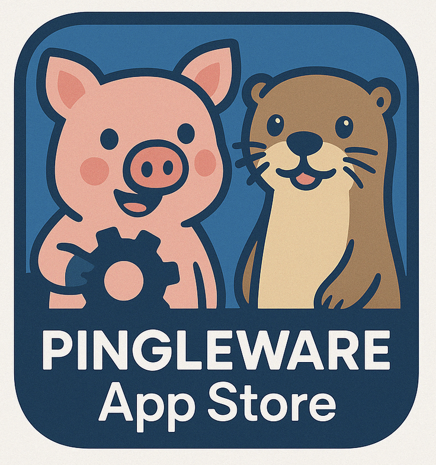

# A GITHUB-based App Store
Creating an **app store on a GitHub Page** can be a great way to showcase and distribute your apps or projects. Here's a step-by-step plan to build a simple, sleek GitHub Pages-based app store using HTML, CSS, and optional JavaScript for interactivity.

---

### **1. Set Up the GitHub Repo**

1. Create a new GitHub repository (e.g., `my-app-store`).
2. Enable GitHub Pages in the repo settings:
   - Go to **Settings > Pages**
   - Source: `main` branch, root (or `/my-app-store` sub-folder if you prefer)
   - Save

---

### **2. Project Structure**

Here’s a simple folder structure:

```
repo/
├──my-app-store/
├──-- index.html
├──-- style.css
├──-- apps/
│   ├──-- app1/
│   │   └──-- info.json
│   ├──-- app2/
│   │   └──-- info.json
├──-- assets/
│   └--── logo.png
└──-- scripts.js
```

---

### **3. `index.html` Template**

```html
<!DOCTYPE html>
<html lang="en">
<head>
  <meta charset="UTF-8" />
  <meta name="viewport" content="width=device-width, initial-scale=1.0"/>
  <title>My App Store</title>
  <link rel="stylesheet" href="style.css" />
</head>
<body>
  <header>
    
    <h1>My App Store</h1>
  </header>

  <main id="app-list">
    <!-- Apps will be loaded here -->
  </main>

  <footer>
    <p>&copy; 2025 My App Store</p>
  </footer>

  <script src="scripts.js"></script>
</body>
</html>
```

---

### **4. `style.css` (basic)**

```css
body {
  font-family: sans-serif;
  margin: 0;
  background: #f9f9f9;
}

header, footer {
  background: #333;
  color: white;
  text-align: center;
  padding: 1em;
}

#app-list {
  display: grid;
  grid-template-columns: repeat(auto-fit, minmax(250px, 1fr));
  gap: 1em;
  padding: 1em;
}

.app-card {
  background: white;
  border-radius: 8px;
  box-shadow: 0 0 10px #ccc;
  padding: 1em;
  text-align: center;
}
```

---

### **5. `apps/app1/info.json` Example**

```json
{
  "name": "Cool App",
  "description": "A really cool app.",
  "image": "https://via.placeholder.com/150",
  "download": "https://example.com/app1.apk"
}
```

---

### **6. `scripts.js`**

```javascript
const apps = ["app1", "app2"]; // Add your app folder names here

const appList = document.getElementById("app-list");

apps.forEach(app => {
  fetch(`apps/${app}/info.json`)
    .then(res => res.json())
    .then(data => {
      const card = document.createElement("div");
      card.className = "app-card";
      card.innerHTML = `
        
        <h2>${data.name}</h2>
        <p>${data.description}</p>
        <a href="${data.download}" target="_blank">Download</a>
      `;
      appList.appendChild(card);
    });
});
```

---

### **7. Push to GitHub**

1. Commit and push your code.
2. Visit your GitHub Page URL (usually `https://<username>.github.io/<repo>/`)

---
